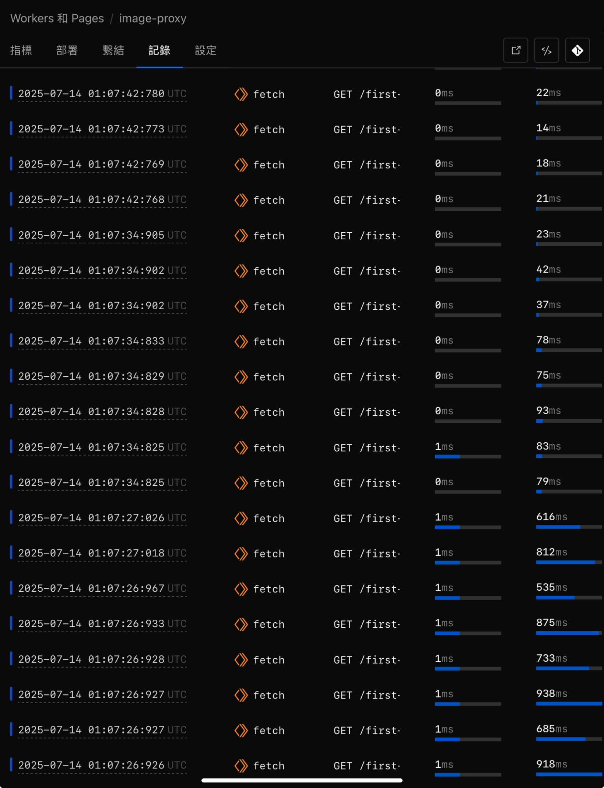

# Cloudflare Workers Project Collection

This is a collection of multiple Cloudflare Workers projects, primarily featuring an image proxy service, basic examples, and Hello World projects.

## Project Structure

```
practice-cloudflare-workers/
├── image-proxy/         # Image Proxy Service (Main Project)
│   ├── src/
│   │   └── index.ts    # Image Processing Worker
│   ├── package.json    # Project Dependencies
│   ├── wrangler.jsonc  # Wrangler Configuration
│   └── tsconfig.json   # TypeScript Configuration
├── basic-sample/        # Basic Example Project
│   ├── src/
│   │   ├── index.ts    # Main Worker
│   │   ├── types.ts    # Type Definitions
│   │   └── endpoints/  # API Endpoints
│   └── README.md       # Project Documentation
├── hello/              # Hello Worker Project
│   ├── src/
│   │   └── index.ts    # Basic Worker
│   └── README.md       # Project Documentation
├── package.json        # Management Tool Dependencies
└── README.md          # This File
```

## Screenshot

Below is a screenshot of the Image Proxy Worker running in the Cloudflare Workers dashboard:



## Main Project: Image Proxy Worker

### Overview

The Image Proxy Worker is a powerful image proxy service that provides the following features:

- **Image Upload & Storage**: Supports PUT requests to upload images to Cloudflare R2
- **Image Resizing**: Supports real-time image resizing
- **Caching Mechanism**: Uses KV to cache processed images, avoiding duplicate processing
- **Concurrency Control**: Uses locking mechanism to prevent duplicate processing of the same image
- **CORS Support**: Complete cross-origin request support

### Key Features

#### 1. Image Upload (PUT)

```bash
curl -X PUT https://your-worker.your-subdomain.workers.dev/image.jpg \
  -H "Content-Type: image/jpeg" \
  --data-binary @image.jpg
```

**Response Format:**

```json
{
  "success": true,
  "signature": "hmac-sha256-signature"
}
```

#### 2. Image Retrieval (GET)

```bash
# Original image
GET https://your-worker.your-subdomain.workers.dev/image.jpg

# Resize image (width 300px)
GET https://your-worker.your-subdomain.workers.dev/image.jpg?w=300
```

#### 3. Image Processing Flow

1. **Cache Check**: First check if processed image already exists
2. **Lock Mechanism**: Use KV as distributed lock to prevent duplicate processing
3. **Image Processing**: Use Photon WASM for image resizing
4. **Store Result**: Save processed image to R2
5. **Release Lock**: Release lock after processing is complete

### Technical Architecture

#### Dependencies

- **@cf-wasm/photon**: WASM image processing library
- **Cloudflare R2**: Object storage service
- **Cloudflare KV**: Key-value storage for lock mechanism

#### Environment Configuration

```json
{
  "secrets_store_secrets": [
    {
      "binding": "IMAGE_PROXY_SECRET",
      "store_id": "your-secret-store-id",
      "secret_name": "IMAGE_WORKER_SECRET"
    }
  ],
  "r2_buckets": [
    {
      "binding": "IMAGE_PROXY_BUCKET",
      "bucket_name": "your-bucket-name"
    }
  ],
  "kv_namespaces": [
    {
      "binding": "IMAGE_PROXY_KV",
      "id": "your-kv-namespace-id"
    }
  ]
}
```

### Development & Deployment

#### Local Development

```bash
cd image-proxy
npm install
npm run dev
```

#### Deployment

```bash
cd image-proxy
npm run deploy
```

#### Type Checking

```bash
cd image-proxy
npm run type-check
```

### Security

- **HMAC Signatures**: Returns HMAC-SHA256 signature after image upload
- **CORS Control**: Restricts allowed origin domains
- **Error Handling**: Complete error responses and status codes

### Performance Optimization

- **Caching Mechanism**: Processed images are cached in R2
- **Concurrency Control**: Prevents duplicate processing of the same image
- **Memory Management**: Properly releases WASM resources

## Other Projects

### basic-sample/

OpenAPI 3.1 based task management API using Hono framework:

- **Complete CRUD Operations**: Create, Read, Update, Delete tasks
- **OpenAPI Auto-generation**: Automatically generates API documentation
- **Request Validation**: Automatically validates request parameters and content

**Quick Start:**

```bash
cd basic-sample
npm install
npm run dev
```

### hello/

Basic Cloudflare Worker project:

- **Simple Endpoints**: Provides `/` and `/api/hello` endpoints
- **TypeScript Support**: Complete type checking
- **Developer Friendly**: Hot reload and local development

**Quick Start:**

```bash
cd hello
npm install
npm run dev
```

## Management Commands

### Create New Project

```bash
npm run init
```

### Development for Each Project

```bash
# Image Proxy
cd image-proxy && npm run dev

# Basic Sample
cd basic-sample && npm run dev

# Hello
cd hello && npm run dev
```

### Deploy Each Project

```bash
# Image Proxy
cd image-proxy && npm run deploy

# Basic Sample
cd basic-sample && npm run deploy

# Hello
cd hello && npm run deploy
```

## Environment Setup

### Image Proxy Required Resources

1. **Cloudflare R2 Bucket**: For storing images
2. **Cloudflare KV Namespace**: For lock mechanism
3. **Secrets Store**: For storing HMAC keys

### Setup Steps

1. Create R2 Bucket in Cloudflare Dashboard
2. Create KV Namespace
3. Configure Secrets Store
4. Update resource IDs in `wrangler.jsonc`

## License

MIT License - See LICENSE files in each project.

## Contributing

Welcome to submit Issues and Pull Requests to improve these projects.
